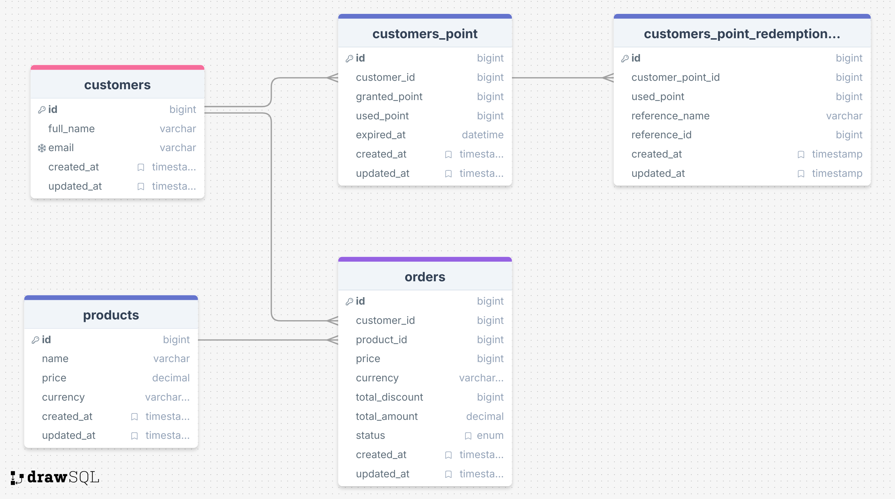

# Software Engineer Practical Test (Task no 4 : Reward System)

## Development

Developed using [Django](https://www.djangoproject.com/) and [Django Rest Framework](https://www.django-rest-framework.org/tutorial/quickstart/)

#### Update settings
1. Change env DB setting to local DB setting for local development (if needed)

#### Create local environment and install all packages
1. Switch to python 3 (if current python environment is not Python 3)
2. Create Virtual Environment
```bash
python -m venv env
```
3. Activate Virtual Environment
```bash
source env/bin/activate
```
4. Install all the packages
```bash
pip install -r requirements.txt
```
5. Create Super User to login to Admin Tools
```bash
python manage.py createsuperuser
```

#### Running the app
1. Run this in terminal (inside project folder and poetry environment)
```bash
python manage.py runserver
```

## A. Flowchart or Sequence UML Diagram

## B. Database Schema Design


## C. Function Implementations
1. API Collection ([API Postman Collection](https://crimson-space-125620.postman.co/workspace/Weplus-API-V2~72086e72-41f9-4b34-8597-b05928da28e1/collection/20436005-17f0ed28-c7c5-43d4-b5a6-eadd0aa92213?action=share&creator=20436005&active-environment=20436005-03ed6fef-08a1-4581-a45e-616241a82dd9))
2. Access the endpoint /admin/ to use admin tools
3. Please spotlight *functions.py* and *helpers.py* in package _services/order_
